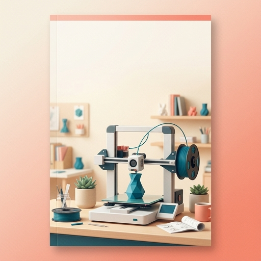

# Impressão 3D para Iniciantes
## Do Primeiro Modelo à Primeira Venda

Um guia prático para sair da curiosidade, fazer uma primeira peça e avaliar se ela pode virar um produto.

> Comece pequeno: aprenda o processo com uma peça simples antes de investir em materiais, acabamento ou divulgação.

## 1. O que é impressão 3D

Impressão 3D é a fabricação de um objeto a partir de um modelo digital, construindo-o aos poucos. Em vez de retirar material de um bloco, a máquina deposita ou solidifica material somente onde o projeto pede. Por isso também é chamada de fabricação aditiva.

Ela é útil para protótipos, peças personalizadas, organizadores, suportes e objetos decorativos. O resultado depende do desenho, da máquina, do material e dos ajustes. Uma impressão não é automaticamente resistente, precisa ou própria para qualquer uso: teste o objeto no contexto real antes de oferecê-lo.

## 2. Como funciona uma impressora FDM

FDM é um processo comum em impressoras de mesa. Um filamento plástico é puxado de um carretel, aquecido no bico e depositado em linhas sobre a mesa. A cabeça se move nos eixos, uma camada se apoia na anterior e o objeto cresce de baixo para cima.

O modelo 3D vira instruções de movimento em um programa chamado fatiador. A primeira camada é especialmente importante: se não aderir bem à mesa, a peça pode se deslocar. Mantenha a área ventilada conforme as instruções do fabricante e nunca toque no bico aquecido.

## 3. Filamentos e suas diferenças

**PLA** costuma ser uma escolha simples para começar: é amplamente usado em peças decorativas e protótipos e costuma imprimir sem exigir uma câmara fechada. Não presuma que a peça será adequada a calor, sol, alimentos ou esforço estrutural.

**PETG** é escolhido em alguns projetos que pedem mais flexibilidade ou resistência ao impacto que uma peça equivalente em PLA. Pode exigir ajustes para reduzir fios e controlar a adesão.

**ABS/ASA** podem atender peças que precisam de propriedades diferentes, mas pedem mais controle de temperatura e ventilação. Verifique as recomendações da impressora e do fabricante do filamento antes de usar.

As características variam por marca, cor e formulação. Confira a faixa indicada na embalagem e faça testes pequenos. Guarde o filamento seco e protegido de poeira; umidade pode prejudicar o resultado.

## 4. Como escolher modelos para imprimir

Para a primeira peça, prefira um modelo pequeno, com base plana, poucos detalhes finos e sem grandes partes suspensas. Isso reduz o tempo e as variáveis do primeiro teste.

Antes de baixar ou vender uma peça, confira a licença do modelo. Um arquivo gratuito pode permitir uso pessoal e proibir redistribuição ou venda de objetos impressos. Para vender, use um desenho próprio ou uma licença que permita claramente o uso comercial; guarde o registro da licença.

Veja também se a peça cabe no volume de impressão da sua máquina, se precisa de suportes e se a orientação escolhida oferece a resistência necessária. Camadas podem se separar sob esforços aplicados em certas direções.

## 5. Configurações básicas de fatiamento

Comece pelo perfil recomendado para a sua impressora e filamento. Altere uma variável por vez e registre o que mudou.

- **Altura de camada:** camadas menores podem mostrar mais detalhe e levar mais tempo; camadas maiores podem acelerar peças simples, com acabamento mais marcado.
- **Paredes e topo/fundo:** determinam parte da espessura externa. Mais material pode aumentar tempo e consumo.
- **Preenchimento:** estrutura interna que ajuda a apoiar superfícies. Mais preenchimento não garante, sozinho, uma peça mais forte.
- **Suportes:** material temporário para regiões que não podem ser impressas no ar. Eles aumentam consumo e trabalho de remoção.
- **Aderência à mesa:** superfície limpa, nivelamento e primeira camada consistente ajudam a evitar deslocamentos.

Não existe um valor universal: máquina, bico, geometria e material mudam o resultado. Use o perfil do fabricante como ponto de partida e valide com uma peça de teste.

## 6. Erros comuns de impressão

**A peça solta da mesa:** confira limpeza, nivelamento e primeira camada; evite alterar várias coisas de uma vez.  
**Fios entre partes:** podem estar relacionados a temperatura, retração ou umidade; teste o filamento e os ajustes recomendados.  
**Camadas deslocadas:** verifique se algo esbarrou na máquina, se a peça se soltou ou se há obstrução no movimento.  
**Peça frágil:** reveja orientação, paredes, material e direção do esforço; não conclua que aumentar preenchimento resolverá.  
**Acabamento irregular:** observe a primeira camada, o fluxo e a temperatura; faça um teste comparável antes de mexer no perfil inteiro.

Anote o sintoma, o ajuste feito e o resultado. Esse pequeno histórico economiza material e evita repetir tentativas sem aprender com elas.

## 7. Como calcular o custo de uma peça

O custo não é apenas o plástico. Monte uma planilha simples com:

1. **Material:** gramas usadas × custo por grama do rolo. Considere suportes e perdas.
2. **Energia:** consumo medido ou estimado da máquina × duração × tarifa local. Se não tiver medição, marque a estimativa como aproximada.
3. **Tempo de trabalho:** preparação, remoção de suportes, acabamento, embalagem e atendimento.
4. **Desgaste e falhas:** reserve uma parcela para manutenção e impressões que não deram certo.
5. **Embalagem e venda:** caixa, proteção, taxas da plataforma e envio, quando aplicáveis.

**Preço mínimo de referência = custos diretos + parcela de custos operacionais + remuneração do trabalho.** Depois compare com preços de mercado e com o valor percebido, sem vender abaixo do custo real. Os valores dependem da sua máquina, tarifa, material, região e canal; levante os seus antes de definir preço.

## 8. Como transformar impressão 3D em produto

Procure um problema específico: organizar cabos, identificar gavetas ou adaptar um suporte são exemplos para investigar, não garantias de demanda. Converse com potenciais compradores e observe alternativas existentes.

Faça um lote de teste, verifique encaixe, estabilidade, bordas e repetibilidade. Defina dimensões e tolerâncias que você realmente mediu. Informe material e cuidados de uso com clareza, e não atribua certificações ou usos seguros sem comprovação.

Use modelos próprios ou com licença comercial. Confira também as regras locais e da plataforma para o tipo de produto. Comece com poucas unidades e registre custo, tempo de produção, dúvidas recebidas e devoluções.

## 9. Fotografia e anúncio

Limpe a peça e fotografe com luz natural indireta, fundo simples e foco nítido. Faça uma foto de frente, outra mostrando detalhes e uma imagem de escala com um objeto de tamanho conhecido. Mostre a peça real e não esconda marcas de camada ou variações relevantes.

Um anúncio útil informa o que é, para que serve, material, medidas verificadas, opções disponíveis, prazo de produção e cuidados. Não invente medidas: meça cada versão. Use título direto e descreva limites de uso.

## 10. Checklist para começar

- [ ] Ler o manual da impressora e entender os cuidados de segurança.
- [ ] Conferir mesa, bico, filamento e perfil recomendado.
- [ ] Escolher um modelo simples e verificar sua licença.
- [ ] Fatiar com o perfil inicial e observar a primeira camada.
- [ ] Registrar material, tempo, ajustes e resultado.
- [ ] Revisar acabamento e testar a peça no uso pretendido.
- [ ] Para vender, confirmar licença, custos, medidas e regras do canal.
- [ ] Fotografar uma unidade real e escrever um anúncio claro.

## Próximo passo

Escolha uma peça pequena para uso próprio, imprima com o perfil recomendado, anote o que aconteceu e só então decida qual variável testar. A primeira meta é aprender um processo repetível; a venda vem depois de validar peça, custo e interesse.

---

**Nota editorial:** este guia é introdutório. Parâmetros, segurança e adequação variam conforme impressora, material, modelo, ambiente e finalidade. Consulte os manuais e as informações do fabricante para o seu equipamento e filamento.
